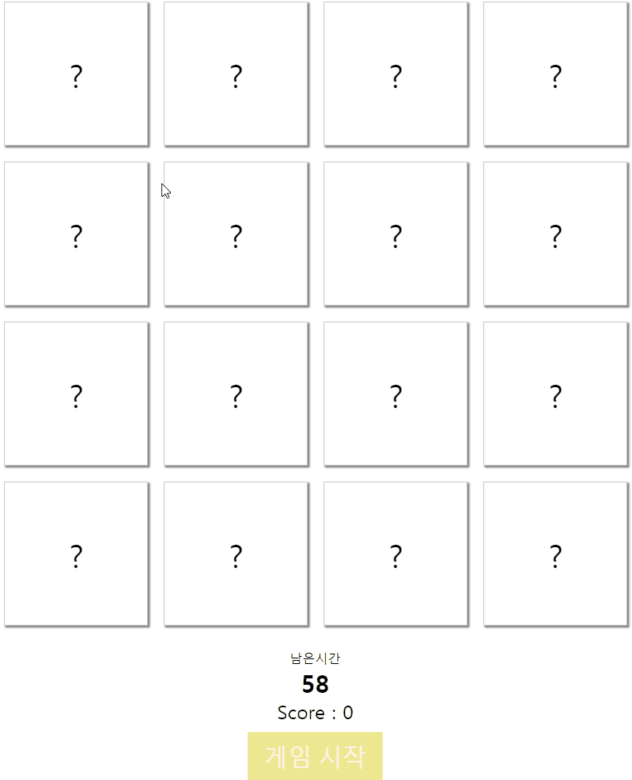

# memoryGame

  - 2장의 카드를 뒤집어 같은 카드면 점수가 올라간다.

## 테스트 화면

  - 

## 설명

  - `images.js`에서 이미지 이름 배열 생성
  - 랜덤 이미지 배열 생성 후 카드 목록을 `map`을 활용하여 `HTML`에 렌더링
  - 카드 비교는 이미지 이름 값으로 배열에 담고 비교
  - 새로고침은 `window.location.reload();` 활용